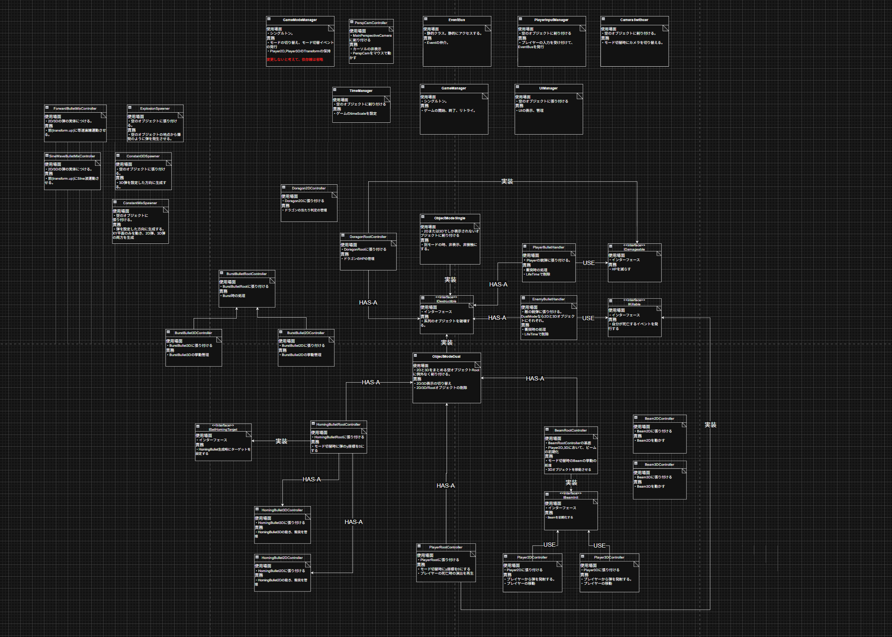

# 移次元シューティング
**2Dと3Dを切り替えられるシューティングゲーム**

| 項目 | 内容 |
| --- | --- |
| **制作時期** | 2025年10月 ～ 2025年11月（大学1年次） |
| **プレイURL** | [unityroomでプレイする](https://unityroom.com/games/transdimensional_shooting) |
| **開発環境** | Unity 6000.0.59f2, C# |
| **主な使用技術** | EventBus (Observer Pattern), draw.io (UML) |

## 🎮 作品概要
「2Dの世界」と「3Dの世界」をリアルタイムに切り替えながら攻略するシューティングゲームです。
サークルの学園祭展示作品として、一か月という明確な納期の中、制作しました。

## 👨‍💻 担当箇所と制作体制
企画からコーディングまで、私がすべて担当しました。
一部の3Dモデル制作のみ、サークルのメンバー（1名）に協力していただきました。

## 🚀 アピールポイント
* 設計を意識した開発: 前作（RussianShot）の反省を活かし、draw.ioを用いてクラスの依存関係を整理しながら実装を行いました。
* 疎結合なクラス設計: 静的クラスEventBusを作り 、Observerパターンを適用しました。これにより、各クラス間の依存度を下げ、機能の追加や変更に強い構成を目指しました。

## 💭 振り返りと反省
本作は制作期間が約1ヶ月と短期間でしたが、前作でのスパゲッティコードの反省を踏まえ、クラス設計を意識した開発に挑戦しました。

### 1. 設計意識の向上と実践
前作ではクラス同士が密結合していましたが、本作ではEventBusを導入することで、コンポーネント間の結合度を大幅に下げることに成功しました。
これにより、「2D/3D切り替え」というシステム全体に影響する処理を、各オブジェクトが個別に購読する形で実装でき、可読性と拡張性が向上しました。

### 2. 開発終盤における設計と実装の乖離
開発初期はdraw.ioを利用し、クラスの依存関係を整理しながら実装を行っていましたが、締め切り直前の追い込み時期において、時間の制約から設計図の更新を止め、場当たり的な実装（AI生成コードの多用や粗い命名）を行ってしまった箇所があります。
「動くものを作る」ことは達成できましたが、「最後まで設計の一貫性を保つ」ためのタイムマネジメント能力と、迅速に実装するスキルの不足が課題として残りました。

### 3. 技術的挑戦とゲーム性の両立
「2Dと3Dを切り替える」という技術的なギミックの実装には成功しましたが、それが必ずしも「ゲームとしての面白さ」に直結しきれなかった点が企画としての反省点です。技術的な実現可能性だけでなく、UXやビジュアル面といったゲームとしての完成度を高める要素にも注力する重要性を学びました。

---
※スクリプトはUnfinished,Tidy_versionとCompleted_versionの二種類を同梱しています。前者は上述の締め切り直前の追い込み時期より前のものであり、後者は学園祭展示時のものになります。

実際に作成したクラス図
 